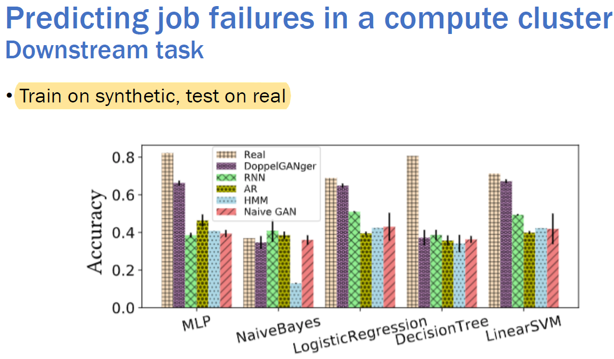

# Here we collect the recent papers, tutorials, etc. about GANs.

## tutorials
[Generative Neural Networks](https://dvl.in.tum.de/slides/adl4cv-ss20/5-GANs-1.pdf)<br>
[course page](https://dvl.in.tum.de/teaching/adl4cv-ss20/)<br>
2020, from  *Advanced Deep Learning for Computer Vision course*, **Technical University of Munich**. <br>

**contents**: <br>
- 介绍生成模型的分类，GAN只是里面的一个分支；
- 介绍GAN的评估方法（e.g., 看数据分布，训练一个分类器进行分类，saliency and diversity）；
- 多种GAN的损失函数;


## reviews
1.[A Review on Generative Adversarial Networks: Algorithms, Theory, and Applications](https://arxiv.org/pdf/2001.06937.pdf)<br>
2020 Jie Gui, Zhenan Sun, Yonggang Wen, **Dacheng Tao, Jieping Ye** from University of Michigan, Chinese Academy of Science, NTU, citation=12; <br>

**content**: <br>
- 从三个角度介绍了GAN 训练过程，对GAN文章进行分类：objective function (LSGAN, Hinge loss GAN); training skills (Improved GANs); network structure (DCGAN, SAGAN,BigGAN);  
- 介绍了三个task driven GANs: semi-supervised learning, transfer learning, reinforcement learning; 
- 介绍了GAN的几个应用场景：image processing and computer vision(image and video); sequantial data (NLP, Music); 

2.[Generative Adversarial Networks (GANs): Challenges, Solutions, and Future Directions](https://arxiv.org/ftp/arxiv/papers/2005/2005.00065.pdf)<br>
2020 , Divya Saxena and Jiannong Gao from **The Hong Kong Polytechnic University**; <br> 

3.[An Introduction to Image Synthesis with Generative Adversarial Nets](https://arxiv.org/pdf/1803.04469.pdf)

2018, He Huang, Philip S. Yu and Changhu Wang, citation=72;

**summary**: 很好的综述文章。详细介绍了**不同的GAN 模型**，GAN 生成图片的模型分类；text-to-image synthesis, image-to-image translation； 并且介绍了生成image的评价指标；


## GAN synthetic data evaluation
[How good is my GAN?](https://eccv2018.org/openaccess/content_ECCV_2018/papers/Konstantin_Shmelkov_How_good_is_ECCV_2018_paper.pdf)<br>
2018, ECCV,   citation=78; <br>
**summary**:两种方法衡量生成图片的质量,base on image classificion；同时分析了，data augmentation；<br>
- train on synthetic data, test on real data; (GAN-train)
- train on real data, test on synthetic data; (GAN-test)

**contribution**:<br>
- 分析了利用生成数据做data augmentation 的影响：在一定数量的real image中加入一定量（50K）的生成数据，提高了ACC；
**（缺点：没有比较同样数量real images场景中，加入不同数量生成数据对结果的影响）--> 更正：在Fig4里面有对比，衡量diversity；**;


[An empirical study on evaluation metrics of generative adversarial networks](https://arxiv.org/pdf/1806.07755.pdf)<br>
2018 ICLR, citation=48, <br>
**summary**: 本文的核心，是评估多种evaluation metric，寻找最好的标准来指导GAN的学习和训练来生成更好的数据，不是寻找评估生成数据的最好标准。二者有重叠部分（生成数据多样性的考虑），
和不同的部分（是否考虑metric的计算开销）；

**method**：<br>
- 出发点：探究哪种情况下，哪种metric最好；哪些情况下，哪些metric会失效；
- 评估指标：**discriminability**, robustness to transformations, efficiency, detecting overfitting; <br> 
**result**: <br>
- MMD and 1-NN 效果最好；
**contribution**: <br>
- 总结了几种最流行的评估方法，Inception score, kernel MMD, Wasserstein distance, FID, 1-NN classifier; 
- 根据实验，得出结论：**In the convolutional space of a ResNet pre-trianed on ImageNet, the choice of feature space in which to compute variousmetrics is crucial**； 
- 

[PATE-GAN: GENERATING SYNTHETIC DATA WITH DIFFERENTIAL PRIVACY GUARANTEES](https://openreview.net/pdf?id=S1zk9iRqF7)<br>
2019 ICLR, citation=22; <br>
**summary**: 首先将*private aggregation of teacher ensembles (PATE)*引入到GANs，得到可以生成很强隐私性的GAN；接下来用一种新的角度评估生成的数据：在生成数据上训练测试算法
应该和在原始数据上得到同样的效果；<br>
**method**：<br>
- 提出三种evaluation methods: train on real, test on real; train on synthetic test on real ; train on synthetic test on synthetic; 

**problem**: <br>
- 没有说明为什么不用train on real and test on synthetic; <br>


[Pros and Cons of GAN Evaluation Measures](https://arxiv.org/pdf/1802.03446.pdf)<br>
2018 , citation=182; <br>
**summary**: 引用量最多的evaluating GANs的综述文章，总结了24 quantitative and 5 qualitative measures；将评估方法分为三种：定量、定性、人工判断；<br>
**method**: <br>
- **evaluating models rather than evaluating synthetic data; evaluating data is part of the task of evaluating the model;**


[Visual Evaluation of Generative Adversarial Networks for Time Series Data](https://arxiv.org/pdf/2001.00062.pdf)<br>
2019 AAAI, citation=0; <br>
**summary**: 大部分本文提出一种human-centered的可视化方法，评估生成的time-series数据；<br>
**method**： 

**contribution**: <br>
- guide a human to decide if data generated by a GAN algorithm can be used to build reliable and trustworthy AI models
- 基于两种可视化方法，让人类专家可以直观的比较oringinal data and generated time series data; 


[Are GANs Created Equal? A Large-Scale Study](https://papers.nips.cc/paper/7350-are-gans-created-equal-a-large-scale-study.pdf)<br>
2018 NIPS, citation=370; <br>
**summary**: 提出使用三个维度precision recall f1衡量GAN的性能；是下面(assessing-generative-models-via-precision-and-recall)的前面一个工作； <br>


[Assessing Generative Models via Precision and Recall](https://papers.nips.cc/paper/7769-assessing-generative-models-via-precision-and-recall.pdf)<br>
2018, NIPS， citation=65; <br>
**method**：<br>
- 使用inception network to embed the images;
**contribution**: <br>
- 分析了IS，FID等方法的缺点：利用one-dimensional score不能区分GAN失败的原因，e.g., 只能生成部分高质量数据，或者是生成所有数据但是质量低，这两种情形得到同样的FID score；
- 在image and text数据集上验证本文提出的方法；
- 有理论证明，
- **只需要有一个embedding vector, 本方法可以使用在任何modal**; 
- 把真实数据和生成数据的分布，划分为两个维度：precision-and-recall; 
- 提出了一种方法，compute precision and recall from samples from P and Q; 
- 本文算法不需要label，就像FID一样，但是IS需要label；
- 设计了Fa, F1/a的评估metric，和大家对VAE的观测一致：VAE生成的数据有更高的recall和很低的precision，也就是说VAE生成数据质量低，但是更少mode collapse; <br>


[Improved Techniques for Training GANs](https://arxiv.org/abs/1606.03498)<br>
2016 NIPS, citation= 3500; <br>
**summary**: 介绍了**Ineption score (IS)**作为评估GAN的标准;<br>

[Image-to-Image Translation with Conditional Adversarial Networks](https://arxiv.org/pdf/1611.07004.pdf)<br>
2018, citation=5600; <br>
**summary**: pixel2pixel, 图像-->图像生成。本文认为任何图像到图像的变换都可以用GAN得到同样的效果，借助CGAN的结构，提出通用的图片转换模型。
**method**: <br>
- 用两种方法评估quality of synthesized images: 1_亚马逊众包机器人，人工判断是真图片还是生成图片； 2)FCN在真实数据训练，在生成数据上测试做语义分割，根据结果打分；
**contribution**: <br>
- 不同的任务需要不同的loss function, **本文提出可以使用一个通用的方法处理多个任务**：图片上色，synthesize photos from label maps;

[Classification Accuracy Score for Conditional Generative Models](https://papers.nips.cc/paper/9393-classification-accuracy-score-for-conditional-generative-models.pdf)<br>
2019 NIPS, citation = 22; <br>
**summary**: 本文设计一个基于分类的方法，验证一个假设：deep generative models（VAE,autogressive model, GANs）学习到了数据的分布，生成的数据可以很好的用于下游任务。得到了令人惊讶的
结果；<br>
**core idea**: 如果模型生成的数据很好，那么train on synthetic data test on real data应该会有很好的结果(if the model capture the data distribution, performance on the downstream
task should be similar whether using original or synthesize data)；
**contribution**: <br>
- 用BigGAN-deep生成数据，用resnet50做分类器，发现**top-1, top-5 acc分别下降27.9%,41.6 compared with original data**;
- 本文发现，传统的IS，FID等evaluation metric，既不能预测classification accuracy score, 也不能用于除了GAN之外的其他生成模型；

[Measures to Evaluate Generative Adversarial Networks Based on Direct Analysis of Generated Images](https://arxiv.org/ftp/arxiv/papers/2002/2002.12345.pdf)<br>
2020, citation=0; <br>
**summary**: 和传统的IS(using classification performance)，FID(statistical metrics)不一样，本文直接分析GAN生成的图片来评估GAN模型，而不是把生成的图片输入到其他分类器。
**contribution**: <br>
- 提出了三种评估生成GAN生成图片的标准：creativity (不是复制原始图片), Inheritance(生成图片和原始图片某种意义上类似), diversity(生成图片彼此不一样); 

[A Classification–Based Study of Covariate Shift in GAN Distributions](http://proceedings.mlr.press/v80/santurkar18a/santurkar18a.pdf)<br>
2018 ICML,  citation = 17; <br>
**summary**: 提出一种基于分类的方法，评估the diversity of GAN; <br>
**problem**: <br>
- *covariate shift*: train set， test set的输入数据分布不同，导致训练集上学习的模型不能泛化到测试集，是最常见的一种dataset shift; 
- mode collapse: GAN生成一个或者少数几个类别的数据，discriminator无法判断真假，这样generator总是尝试生成这几类数据因为可以骗过discriminator，导致diversity of GAN收到损害；
- boundary distortion: 好像指的是GAN生成的数据在分布边界没有抓住真实分布的特点，导致了covariate shift，这种loss of diversity可使用基于分类的方法检测；
**contribution**: <br>
- 用基于classification的方法measure covariate shift;
- 验证了两种GAN带来的covariate shift：mode collapse, boundary distrotion;  
- 本文方法需要很少的人工监督，并且可以很简单的用来在其他数据集上评估其他的GAN模型；**通过在真实数据集训练分类模型M，用M在生成数据集上推理生成标签，类似于自动annotator**；

## time series generation

### famous scholar

[Zinan Lin-PhD student at CMU](http://www.andrew.cmu.edu/user/zinanl/publications/)

### papers

[1.Recurrent Conditional GANs for Time Series Sensor Modelling](http://roseyu.com/time-series-workshop/submissions/2019/timeseries-ICML19_paper_2.pdf)<br>
2019 ICML, citation=1; <br>

[2.Real-valued (Medical) Time Series Generation with Recurrent Conditional GANs](https://arxiv.org/abs/1706.02633)<br>
2017,   citation=133; <br>

[3.Time-series Generative Adversarial Networks](https://papers.nips.cc/paper/8789-time-series-generative-adversarial-networks.pdf)

[Supplementary material](https://www.vanderschaar-lab.com/papers/NIPS2019_TGAN_Supplementary.pdf)

[NIPS review](https://media.nips.cc/nipsbooks/nipspapers/paper_files/nips32/reviews/2946.html)

2019 NIPS, Jinsung Yoon (UCLA), Daniel Jarrett and Mihaela van der Schaar (University of Cambridge), citation=9; <br>
**summary**: 
**method**: <br>

- **validation**: qualitative (t-SNE,PCA可视化), quantitative(train on synthesize test on real to predict sequence); 

**problem**: <br>

- 生成了多种数据(sines,stock,energy,events)，没有把synthetic data可视化出来看看效果；画出sin原始图形之后发现数据只有24个点，不到四分之一周期，不是完整的sin波形;
**画出sin生成图形发现波形起伏较大，不平稳**; 


[4.Time Series Simulation by Conditional Generative Adversarial Net](https://arxiv.org/abs/1904.11419)<br>
2019, Rao Fu, Jie Chen, Shutian Zeng, Yiping Zhuang, Agus Sudjianto from (Corporate Model Risk Management at **Wells Fargo**), citation=4; <br>
**summary**: 本文用CGAN生成金融领域的时序数据，用的是较为简单的全连接模型作为G，D；说明了CGAN可以很好的 1)learn normal or heavy tail distribution; 2)capture 
dependent sturctures of different time series data;3)可以很好的对时序数据做预测
 **generate conditional predictive distributions consistent with training data distributions**; 

**method**:
- 用的condition分为三种：**categorical, integer(0,1,2), continuous**; 

**future work**:
- 给CGAN不同的condition来训练，比如continuous and categorical label joint distribution 作为condition (**可以捕捉全局和局部信息**)；
- 捕捉时序数据的second order information;

**Q**： **使用CGAN，和我每次训练一种类型的数据有啥区别**？？


**[5.Generating High-fidelity, Synthetic Time Series Datasets with DoppelGANger](https://arxiv.org/abs/1909.13403)**

2020 IMC, with another title "**Using GANs for Sharing Networked Timeseries Data: Challenges, Initial Promise, and Open Questions**";  **[Zinan Lin](http://www.andrew.cmu.edu/user/zinanl/)**, [Alankar Jain](https://www.linkedin.com/in/alankar-jain-5835ab5a/) **CMU**, [Chen Wang](https://wangchen615.github.io/) (from **IBM**), [Giulia Fanti](https://www.andrew.cmu.edu/user/gfanti/), [Vyas Sekar](https://users.ece.cmu.edu/~vsekar/) from **CMU**;  citation=1;

**summary**: Generating realisic and privacy-preserving synthetic data of both continuous (network traffic measurement) and discrete data(protocol  name, attribute) for network and system communities. 

**advantages**: This paper is well written and easy to follow. The problem and challenges are clearly stated. 

**data**:

- Wikipedia web traffic data
- geographically distributed broadband measurement (家庭网络使用数据)
- compute cluster usage measurement (机房机器使用数据)


**detail**： 

- generator：生成attribute：用MLP，生成feature：用RNN；
- discriminator： 两个判别器：一个MLP判别器判断feature，效果不好；加一个判别器只判断属性attribute；
- 生成的attribute：Figure 15,16,17, 生成WWT 的access type, agent 统计信息和真实信息的对比；（应该是预测的未来50的情况）

**experiment验证生成数据**：

- 真实数据 = A + A‘，（1：1）； 用A 训练GAN， 生成B 和B’； （1：1）； 用A 和 B 分别训练model，在 A' B' 分别测试；   
- 预测未来机房网络会产生什么类型的任务数据：predict the task and event type on GCUT data; 
- WWT： forecasting the page views in the next 50 days; （train on B, test on A'）预测的是feature，
- 根据生成的机房数据feature，预测机房的failure：
- 

**Q**：

- 文章的atribute和label有啥区别？后面说可以根据需要生成不同attribute的数据，感觉和CGAN很像；
- 比如维基百科访问数据，attribute：agent（spider..）,access type(mobile-web, desktop...); 这些属性值都是有实际意义的，而且可能的数值也有限，GAN生成的结果是否检查了这种语义？
- 实验验证中： B 训练的模型，有没有在真实数据A‘ 上做测试？ 还是只是在 生成的B’ 上测试？ 
  - 好像是在A‘ 真实数据做的测试？ Figure 11; 那么B’ 有啥作用？
- 本文的GAN生成的是attribute，还是feature？还是两个都有？
  - 因为同时生成attribute和feature太难（根据naive GAN的经验），我们先生成attribute，then features conditioned on the attributes;
- section 5.2：felxibility，生成指定分布的attribute？ 还是给定attribute生成 features？

[6.Learning to Simulate Human Mobility](https://dl.acm.org/doi/pdf/10.1145/3394486.3412862)

2020 KDD, Jie Feng, Zeyu Yang, Fengli Xu, Haisu Yu, Mudan Wang, Yong Li from **Tsinghua University**. 


[7.Hide-and-Seek Privacy Challenge Synthetic Data Generation vs. Patient Re-identification with Clinical Time-series Data](https://arxiv.org/pdf/2007.12087.pdf)

[website](https://www.vanderschaar-lab.com/privacy-challenge/)

NIPS 2020 challenge. 

[8.CorGAN: Correlation-Capturing Convolutional Generative Adversarial Networks for Generating Synthetic Healthcare Records](https://arxiv.org/pdf/2001.09346v2.pdf)

2020, Amirsina Torfi, Edward A. Fox from Verginia Tech.

CODE: https://github.com/astorfi/cor-gan   

https://github.com/astorfi/cor-gan


[9.Synthetic Event Time Series Health Data Generation](https://arxiv.org/pdf/1911.06411.pdf)

2019 NIPS workshop, Machine learning for Health; 


## GAN privacy


1.[LOGAN: Membership Inference Attacks Against Generative Models](https://arxiv.org/pdf/1705.07663.pdf)

2018, UCL, citation = 68;

**summary**: 很好的文章，讲了生成模型的membership inference attack， defence的分析；


2.[GAN-Leaks: A Taxonomy of Membership Inference Attacks against Generative Models](https://arxiv.org/pdf/1909.03935.pdf)

2020 **CCS**, from Dingfan Chen, Ning Yu, Yang Zhang, Mario Fritz from **CISPA Helmholtz Center for Information Security, Germany**, **MPI and U of Maryland**;

**summary**: 本文对生成模型的membership inference attack做了一个分类，并且研究了对三种数据的攻击：, images, medical data, and location data。


## GAN with fancy ideas
1.[Progressive Growing of GANs for Improved Quality, Stability, and Variation](https://arxiv.org/abs/1710.10196)<br>
2018 ICLR , Tero Karras, Timo Aila, Samuli Laine, Jaakko Lehtinen, citation=1834; <br>
**summary**: a new training methodology: 通过循序渐进progressive的方法，逐步从低分辨率生成高分辨率图片;不仅加速了训练过程也使得训练更加稳定，同时可以生成更加高分辨率图片； <br>

**contribution**: <br>
- 本文简化了minibatch discrimination大学习，不用超参数和学习的参数，提高GAN生成数据的多样性；

[Autoregressive Generative Adversarial networks](https://openreview.net/pdf?id=Hyo9zDuIz)<br>
2018 ICLR workshop, Yasin Yazıcı, Kim-Hui Yap (**NTU**) and Stefan Winkler (**UIUC**) citation=2; <br>
**summary**: 利用**自回归模型对latent distribution建模**，而不是传统的用D对sample进行real/fake二分类来实现； <br>

[Image-to-Image Translation with Conditional Adversarial Networks](https://arxiv.org/pdf/1611.07004.pdf)<br>
2018, Phillip Isola Jun-Yan Zhu Tinghui Zhou Alexei A. Efros from **UC Berkeley**,citation=5600; <br>
**summary**: **PATCH-GAN**; 将生成图片分成很多patch，对每个patch用D判断是否是真图片；可以更好抓住局部特征（传统GAN都是对整个图片进行判断）；

[2.Catalysis Clustering with GAN by Incorporating Domain Knowledge](https://dl.acm.org/doi/pdf/10.1145/3394486.3403187)

2020 KDD, Olga Andreeva (University of Massachusetts Boston) etc.

**summary**: This paper utilizes GAN to incorporate domain-knowledge in clustering task. 传统的聚类任务选择距离函数很麻烦；并且针对不同的任务需要设计不同的距离函数，很困难。所以要想解决这个问题，就需要把domain-knowledge融入到聚类的过程中。本文通过用GAN生成部分数据参与聚类的方法，来实现这个目标。**GAN生成的数据最后会去掉，所以是一个催化剂的作用：“Catalysis”**；


## video generation

[网站-video generation](https://paperswithcode.com/task/video-generation/latest)<br>
video generation papers with code; 34篇生成video的论文(e.g., **DVD-GAN,TGAN-F**)，有生成效果在不同数据集上的排名;<br>

[ImaGINator: Conditional Spatio-Temporal GAN for Video Generation](https://hal.archives-ouvertes.fr/hal-02368319/document)<br>

2020, citation=2; <br>

[Learning to Generate Time-Lapse Videos Using Multi-Stage
Dynamic Generative Adversarial Networks] (https://arxiv.org/pdf/1709.07592.pdf)<br>
2018, citation=58; 


[MoCoGAN: Decomposing Motion and Content for Video Generation](https://arxiv.org/pdf/1707.04993.pdf)<br>
2017, citation = 318; <br>

[**DVD-GAN**-ADVERSARIAL VIDEO GENERATION
ON COMPLEX DATASETS](https://arxiv.org/pdf/1907.06571.pdf)(br)
2019, citation = 15; <br>


## tabular data generation

tabular data


1.[TabNet: Attentive Interpretable Tabular Learning](https://arxiv.org/pdf/1908.07442.pdf)

2020, Sercan O. Arık and Tomas Pfister from Google Cloud AI, citation = 10;

**summary**: 结合decision tree和DNN的优点，设计一个处理raw tabular data的网络TabNet，处理分类和回归问题。实现高性能和可解释性的效果，并且吊打以前很多模型。最后，验证了self-supervised learning在tabular data上可以提高模型的效果。

**contribution**:

- 第一次在tabular data做self-supervised learning（**通过predict masked features**）; 并且通过自监督提高了神经网络的效果。
- 应用了 sequential attention 机制在每个decision step选择feature，提高模型的效果；We employ a learnable mask M[i] ∈ for soft selection of the salient features; 
- 设计了一个tree+DNN的神经网络结构（**利用tree和神经网络各自的优点：可解释性，快速 VS 端到端和表征学习**），和传统的tree-based DNN 不一样：
- 网络结构如下图：每一个decision step，和tree一样，对样本进行分割，每个step的feature transformer应该是一样的？和LSTM每个时间步一样？


2.[Modeling Tabular Data using Conditional GAN](https://papers.nips.cc/paper/8953-modeling-tabular-data-using-conditional-gan.pdf)

2019 **NIPS**, Lei Xu et al. , from MIT, citation = 25;


**contribution**: 

- 设计了一个conditional GAN，生成tabular data；可以学习比bayasian network更好的distribution；

- 可以指定生成某一个column的feature数据，并且调节某个feature值出现的概率；比如：

- > ```
  > samples = ctgan.sample(1000, "workclass", "Private")
  > ```

- 提供一个benchmark system ， tabular data生成的benchmark；

- **（作者说是本文invent mode-normalization）设计了 mode-specific normalization, 对不用的mode使用不同的normalization**方法；

**tabular data特点**：

- mixed data type: 离散的和连续的
- non-Gaussian distribution: 和图片的pixel不一样，Continuous values in tabular data are
  usually non-Gaussian where min-max transformation will lead to vanishing gradient problem.
- Learning from sparse one-hot-encoded vectors： 会影响discriminator的判断，可能只根据数据的sparsity判断真假；
- **Highly imbalanced categorical columns**. In our datasets we noticed that 636=1048 of the categorical columns are highly imbalanced,
- multimodal: 数据多模态

**problem**： 衡量标准是：(likelihood fitness) data distribution and machine learning utility; 没考虑privacy；

## GAN loss functions


## GAN - learning method
1.[Self Adversarial Training for Human Pose Estimation](https://arxiv.org/pdf/1707.02439.pdf)<br>
2017 **APSIPA ASC**, citaion=73; <br>
**summary**: 用两个相同的网络分别作为判别器和生成器，生成器生成人体姿势的估计，判别器来distinguish generated pose from groud-truth heatmap；
训练接收后保留生成器，就可以作为human pose estimator; <br>

## GAN application - image to image translation

[1.pix2pix-Image-to-Image Translation with Conditional Adversarial Networks](https://arxiv.org/pdf/1611.07004.pdf)

2017 CVPR, Phillip Isola Jun-Yan Zhu Tinghui Zhou Alexei A. Efros from **UC Berkeley**.

**summary**: 本文基于CGAN，做通用的general-purpose的image-to-image translation（白天黑夜转换，素描到图片，颜色转换，labels to street scene）；需要成对的图片作为训练数据；CGAN 适合做图片转换的问题，因为：we condition on an input image and generate a corresponding output image.这里的condition不是分类问题中的label，而实一张图片；

**method**:

- G: U-net 做为生成器，D：patchGAN作为判别器，在image patch的级别做图像的判别，而不是完整的图片，可以生成更清楚的图片，**capture local style statistics**；
- loss: D的loss分为两个，L1loss和patch loss. 因为L1可以捕捉全局低频的关系，但是无法model 高频的细节，所以作者提出patch loss捕捉高频局部的特征，对N/* N 个patch分类real 和fake；
- 传统做成对训练的cGAN都是输入z,y（条件图片），作者考虑到z一般没啥用，就没有用z，只输出源图x给G，生成的G(x),和真实的目标图片y给D；
- 

**contribution**：

- 证明了在很广泛的问题上，CGAN可以获得很好的结果；提出了一个很简单的框架来进行图像转换；
- 

2.[CycleGAN-Unpaired Image-to-Image Translation using Cycle-Consistent Adversarial Networks](https://arxiv.org/pdf/1703.10593.pdf)<br>
2017 ICCV, Jun-yan Zhu, Taesung Park, Phillip Isola, Alexei A. Efros from **UC Berkeley**, citation =5000; <br>
**summary**: 本文是pix2pix后续的一个工作,解决图像翻译需要成对训练数据的问题。This paper solve the image to image problem without the presence of paired images. To be specific, this paper design a GAN framework to **transfer the style **of image set A to image set B without using paired images. TO solve the problem of 

1) unpaired mapping betweeen a specific image in set A and set B, 

2) mode collapse during training, the authors design two mappings, G: X --> Y, and F: Y-->X;
exploiting the idea from machine translation **"cycle translation"**, i.e., when translating  English into French, the algorithm should be able to translate the French back to English and  the English sentence should be the same as the original one. 

**contribution**：

- 1）不需要成对的训练数据训练，是对pix2pix的改进，因为很多场景是得不到成对的数据的；
- 2) 提出cycle consistence loss, X = F(G(X)), 类似于语言翻译，图片从x空间翻译到y空间，还要能翻译回来，才是一个好的翻译；
- 

[3.pix2pixHD-High-Resolution Image Synthesis and Semantic Manipulation with Conditional GANs](https://arxiv.org/abs/1711.11585)

2018 CVPR, Ting-Chun Wang1 Ming-Yu Liu1 Jun-Yan Zhu2 Andrew Tao1 Jan Kautz1 Bryan Catanzaro from **UC Berkeley**;

**summary**: 本文是CycleGAN之后的工作，解决的是生成高清图像+逼真图像的问题，2048\*1014的图像。

**method**：

- 两级生成网络G：在G2中嵌入G1，和progressive GAN很像。G1生成1024\* 512, 输入给G2，输出2048\*1024； 


4.[GeoGAN: A Conditional GAN with Reconstruction and Style Loss to Generate Standard Layer of Maps from Satellite Images] (https://arxiv.org/pdf/1902.05611.pdf)

2019, Swetava Ganguli, Pedro Garzon, Noa Glaser from **Stanford U**, citation = 10; <br>
**summary**: CGAN + **style loss** ，以谷歌地图和谷歌地球的数据源来**生成地图**；
**Question**: 

- 生成的效果怎么样？ 图片好像看不出有啥特点？


## GAN application - abnormal detection
[ABNORMAL EVENT DETECTION IN VIDEOS USING GENERATIVE ADVERSARIAL NETS](https://arxiv.org/pdf/1708.09644.pdf)<br>
2017, citation= 117; <br>

[Future Frame Prediction for Anomaly Detection – A New Baseline](https://openaccess.thecvf.com/content_cvpr_2018/papers/Liu_Future_Frame_Prediction_CVPR_2018_paper.pdf)<br>
2018 CVPR, citation = 131; <br>


## GAN application - unsupervised learning
1.[UNSUPERVISED REPRESENTATION LEARNING WITH DEEP CONVOLUTIONAL GENERATIVE ADVERSARIAL NETWORKS](https://arxiv.org/pdf/1511.06434.pdf)<br>
2016 ICLR, Alec Radford & Luke Metz from (indico Research), Soumith Chintala from (Facebook AI), citation=6500; <br>


2.[Wasserstein GAN](https://arxiv.org/pdf/1701.07875.pdf)<br>
2017 , Martin Arjovsky, Soumith Chintala, Léon Bottou from **Courant Institute of Mathematical Science, Facebook AI**, citation=4643; <br>
**summary**: **WGAN**; 

3.[Improved Training of Wasserstein GANs](https://arxiv.org/abs/1704.00028)<br>
2017 NIPS, Ishaan Gulrajani, Faruk Ahmed, Martin Arjovsky, Vincent Dumoulin, Aaron Courville from **MILA, Courant Institute of Mathematical Science, CIFAR Fellow**, 
citation = 3051; <br>
**summary**: **WGAN-GP**; WGAN使得GAN训练更加稳定，但是由于WGAN critic weight clipping,有时候训练不好收敛或者生成数据效果差； 本文提出一种新的clipping weight方法，使得训练更加稳定效果更好；<br>

**contribution**: <br>
- 在一些数据集上说明了为什么critic weight clipping会导致不好的结果；
- 本文提出gradient panalty (**WGAN-GP**)使得训练更加稳定，避免了WGAN遭遇的现象；
- 在多个GAN 的结构上验证了本文的WGAN-GP可以有更稳定的训练更好的生成效果；

4.[Self-Attention Generative Adversarial Networks](https://arxiv.org/abs/1805.08318)<br>
2018 , 2019 ICML; Han Zhang, Ian Goodfellow, Dimitris Metaxas, Augustus Odena, citation=800; <br>


5.[InfoGAN-Interpretable Representation Learning by Information Maximizing Generative Adversarial Nets](https://arxiv.org/abs/1606.03657)

code： https://github.com/raahii/infogan-pytorch

2016, NIPS，**OpenAI**, citation = 2000;

**summary**: 本文通过改进loss function提出一种新的InfoGAN,学习distangled representation，这是无监督学习中的一个痛点。

**method**：无监督学习是从没有标签的数据中学习出有用价值。representation learning 是无监督学习一个流行的框架：learning a representation that exposes useful semantic information from unlabelled data, 从没有标签的数据中学习出一个表征，可以反应数据的语义信息。因为无监督学习下游任务的不确定，如果能学习出不同特征分别对应的表征(distangled representation)就可以大大的提高下游任务（classification, segmentation...）的效果。我们相信，如果能够生成很好的数据，就说明模型对数据非常理解，所以本文提出了infogan来学习分离的表征。

传统的GAN输入噪声Z不能控制输出的特点，z的不同维度不知道分别对应于输出图片的哪些特征。本文将z分成噪声z和不同的latent code，c1,c2...分别控制输出图片的内容和图片的不同风格特征。比如人脸生成，c1,c2,c3分别代表hair style, eye color, identity of a person... 控制图像特征的c1,c2..应该要与图像内容的关系越小越好，也就是c, G(z,c)互信息越大越好， I(c, G(z,c)) 越大越好。于是，作者在G的loss中加入互信息控制量。

 

**problem**: 互信息？ 和CGAN有啥关系？

**experiment**:

采用DC-GAN的网络结构；MINIST，chair，face实验结果表明，无监督学习到的不同的latent code可以分别控制不同的图片特征，c1,c2,c3分别表示数字类别，倾斜角度，画笔宽度：


## GAN - image generation

1.[Diverse Image Generation via Self-Conditioned GANs](https://openaccess.thecvf.com/content_CVPR_2020/papers/Liu_Diverse_Image_Generation_via_Self-Conditioned_GANs_CVPR_2020_paper.pdf)

2020 CVPR, Steven Liu, Tongzhou Wang, David Bau, Jun-Yan Zhu, Antonio Torralba from **MIT and Adobe**; 

**summary**: **CGAN**:本文不用手工的标签，而是基于判别器D的特征空间中的聚类得到的不同cluster， 来生成逼真并且**diverse**的图片。本文的方法可以减少mode collapse，并且再ImageNet等大型数据集上的多个指标表现很好（diversity, other metrics）。


2.[Tag2Pix: Line Art Colorization Using Text Tag With SECat and Changing Loss](Tag2Pix: Line Art Colorization Using Text Tag With SECat and Changing Loss)

2019 ICCV, from Seoul National U, citation=8;

**summary**: 本文基于文本的tag(blonde_hair, purple eyes...)信息，给灰色的卡通图画上色。


**discriminator**：input：彩色的图片；out：real or fake; 还有对使用哪种CIT (color invariant tag）和CVT (color variant tag)的猜测；（收到ACGAN的启发，multi-label classification 起到了很重要的作用）；

## GAN development

**GAN**: 2014, MLP  <br>

- 当用一类图片训练的时候，生成这一类图片，否则是混合的效果；
- 

**DCGAN**: 2015, GAN+CNN, 把CNN引入GAN，反卷积生成清晰的图像；

 [DCGAN](https://arxiv.org/pdf/1511.06434.pdf)

**CGAN**: 

[Conditional Generative Adversarial Nets](https://arxiv.org/pdf/1411.1784.pdf)

- [1]-将标签向量和噪声向量拼接，生成指定标签类别的图片；

- [2]-输入是image+tags（来自不同用户的模糊tag，语义信息）+label； 输出是对每种图片生成一堆文本tags，挑选最好的20个；

  - 作用：an effitient way to normalize tags and labels from different users; 
  - future work: 现在是一次赛一个image+一个tag训练；以后可以一次塞进多个tags+一个image；

  


**CycleGAN**: <br>

- 两个生成器两个判别器，图像风格迁移;

**CoGAN**: <br>
- coupled GAN, 有两组GAN网络同时训练，图片生成效果比DCGAN更好；

**ProGAN**: <br>

- **core idea**: 逐步生成高分辨率图片，4\*4 --> 8\*8 --> ... --> 1024\*1024; 稳定GAN训练过程; 

**WGAN**: <br>

- 提出一种新的loss稳定GAN的训练，解决梯度消失问题；

**SAGAN**： <br>
- self attention, 引入自注意力机制，关注图片中重要的信息，传统方法只能关注局部信息; 

**BigGAN** <br>
- from DeepMind, 大型的GAN网络，以SAGAN为基础；

**StyleGAN**: <br>
- 致力于控制生成图片的风格style; 

